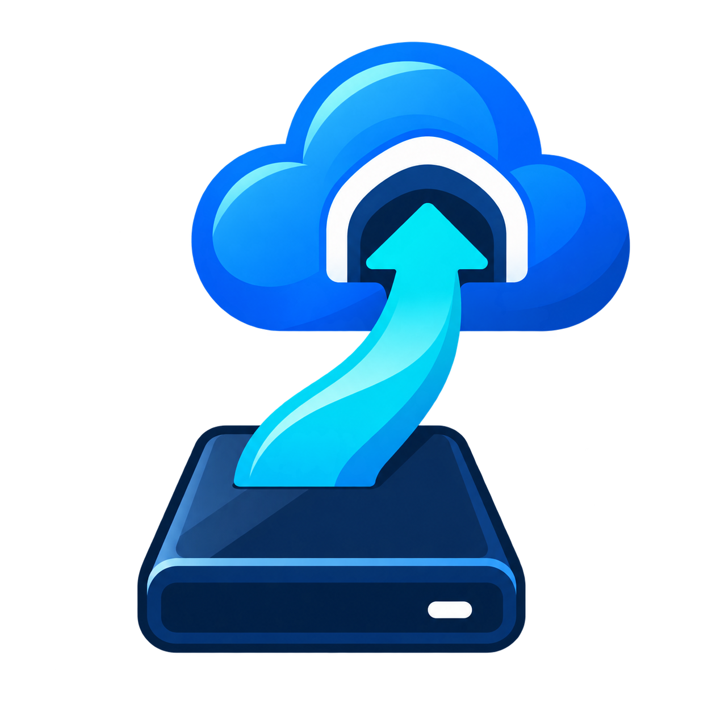

# DriveHarbor

> Sincronizzazione locale, semplice e sicura da SSD esterno a OneDrive per Windows.




> [!IMPORTANT]
> DriveHarbor è in sviluppo. Prima della prima release pubblica deve completare
> la checklist manuale su directory di test isolate.

## Cos'è DriveHarbor

DriveHarbor è un'applicazione desktop gratuita per Windows 11 che copia una
cartella presente su un SSD esterno verso una cartella locale sincronizzata dal
client ufficiale OneDrive.

```text
SSD esterno → DriveHarbor → cartella OneDrive locale → client OneDrive → cloud
```

L'applicazione funziona completamente in locale: non usa Microsoft Graph, non
richiede account aggiuntivi, non include telemetria e non invia dati all'esterno.

## Stato del progetto

La versione corrente è `1.0.0-beta.1`. Sono disponibili la foundation tecnica, il
modello di configurazione locale e le regole di sicurezza dei percorsi. Le
funzioni di rilevamento stabile del volume sorgente sono incluse; la copia vera
e propria è collegata alla dashboard WPF tramite preflight conservativo. Le
funzionalità vengono aggiunte tramite Pull Request piccole e verificabili.
Consulta la [roadmap](docs/roadmap.md) per la sequenza prevista.

## Interfaccia

La dashboard mostra stato SSD e OneDrive, modalità, ultima sincronizzazione,
ultimo risultato e log in tempo reale. La pagina Impostazioni permette di
selezionare sorgente, destinazione, modalità, esclusioni e posizione dei log.

La UI resta reattiva mentre Robocopy lavora e offre l'annullamento. Lo stato dei
volumi viene aggiornato periodicamente. Per Mirror il flusso è deliberatamente
più lungo:

1. conferma per avviare l'analisi;
2. anteprima Robocopy senza modifiche;
3. nuova conferma esplicita prima dell'esecuzione reale.

La pagina Impostazioni confronta direttamente Backup e Mirror e chiarisce quali
file restano o vengono eliminati dalla destinazione prima della selezione.
L'aspetto può essere impostato su Sistema, Chiaro o Scuro. La modalità Sistema,
predefinita, segue il tema delle app configurato in Windows anche mentre
DriveHarbor è aperto.

## Configurazione locale

Le impostazioni vengono salvate in:

```text
%LocalAppData%\DriveHarbor\settings.json
```

Il formato JSON è versionato e il salvataggio usa un file temporaneo sostituito
atomicamente. Un file assente produce impostazioni sicure con modalità Backup;
un file corrotto o di versione sconosciuta non viene sovrascritto e richiede la
verifica dell'utente.

La validazione rifiuta:

- sorgente o destinazione mancanti e non disponibili;
- percorsi uguali;
- una cartella contenuta nell'altra, in entrambe le direzioni;
- destinazioni esterne alle cartelle OneDrive note a Windows;
- percorsi che attraversano junction o link simbolici;
- una posizione log sovrapposta a sorgente o destinazione.

Le modifiche annullate nella pagina Impostazioni vengono scartate e non cambiano
la configurazione usata per sincronizzare.

## Rilevamento dell'SSD

DriveHarbor non si affida soltanto alla lettera dell'unità. Al momento della
configurazione acquisisce, quando Windows li rende disponibili:

1. GUID del volume;
2. numero seriale del volume;
3. etichetta, usata solo per distinguere corrispondenze multiple.

Quando l'SSD viene ricollegato con una lettera diversa, il percorso relativo
della cartella sorgente viene applicato alla nuova unità. La sola etichetta non
è considerata un'identità sufficiente. Corrispondenze assenti o ambigue bloccano
la futura sincronizzazione.

Windows può classificare un SSD USB come unità `Fixed`; per questo DriveHarbor
non rifiuta un volume basandosi soltanto sul tipo riportato dal sistema.

## Motore di sincronizzazione

La V1 usa `robocopy.exe`, incluso in Windows, avviato senza finestra console e
con output acquisito in modo asincrono. Il motore supporta:

- Backup con `/E`, senza opzioni di eliminazione;
- Mirror con `/MIR`, bloccato senza conferma esplicita;
- anteprima con `/L`, che elenca le operazioni senza modificare i file;
- due nuovi tentativi con attesa breve per file temporaneamente occupati;
- esclusione delle junction per evitare loop;
- annullamento con terminazione del processo figlio;
- interpretazione corretta dei codici Robocopy: da 0 a 7 non sono errori;
- controllo preventivo di almeno 256 MB liberi nella destinazione;
- messaggi specifici per spazio, permessi, file occupati e percorsi lunghi.

Il log locale usa file giornalieri in `%LocalAppData%\DriveHarbor\Logs`, con 30
giorni di conservazione, massimo 10 MB per file e 100 MB complessivi. Le righe
sono limitate e non viene mai letto o registrato il contenuto dei file utente.

> [!WARNING]
> Mirror può eliminare elementi nella sola destinazione. La UI esegue preflight,
> anteprima e doppia conferma, ma una copia indipendente resta indispensabile.

## Backup e Mirror

| Modalità | Copia file nuovi e modificati | Elimina dalla destinazione |
| --- | --- | --- |
| **Backup** (predefinita) | Sì | Mai |
| **Mirror** | Sì | Sì, solo dopo conferma esplicita |

Mirror verrà progettata con controlli più restrittivi. DriveHarbor non elimina
mai elementi dalla sorgente. Se lo stato del disco o dei percorsi è incerto,
l'operazione deve fermarsi.

## Requisiti

### Per utilizzare una futura build self-contained

- Windows 11 x64.
- Client ufficiale OneDrive configurato.
- Robocopy, incluso in Windows.

### Per lo sviluppo

- Windows 11.
- [.NET 10 SDK](https://dotnet.microsoft.com/download/dotnet/10.0), versione
  definita in `global.json`.
- Visual Studio con supporto .NET 10 e workload desktop .NET, oppure .NET CLI.
- Git.

## Sviluppo locale

```powershell
git clone https://github.com/MilitantMercury/DriveHarbor.git
cd DriveHarbor
dotnet restore DriveHarbor.slnx
dotnet build DriveHarbor.slnx --configuration Release --no-restore
dotnet test DriveHarbor.slnx --configuration Release --no-build
dotnet run --project src/DriveHarbor.App/DriveHarbor.App.csproj
```

I test che coinvolgeranno file useranno esclusivamente directory temporanee
create per il singolo test. Non devono essere eseguiti test distruttivi su
directory reali dell'utente.

La [validazione release](docs/release-validation.md) descrive i test reali di
Backup e Mirror eseguiti da Robocopy su fixture temporanee sacrificabili.

## Build pubblicabile

```powershell
dotnet publish src/DriveHarbor.App/DriveHarbor.App.csproj `
  --configuration Release `
  --runtime win-x64 `
  --self-contained true `
  --output artifacts/DriveHarbor-win-x64
```

La pipeline GitHub Actions esegue restore, build, test e produce un artifact
self-contained per Windows x64. La pubblicazione non è ancora una release
firmata né un installer.

I tag `v*` avviano un secondo workflow che crea archivio ZIP, checksum SHA-256,
attestazione Sigstore della provenienza e GitHub Release in stato **draft
pre-release**. Checksum e bundle `.sigstore.json` vengono allegati allo ZIP. La
provenienza può essere verificata con:

```powershell
gh attestation verify .\DriveHarbor-<versione>-win-x64.zip `
  --repo MilitantMercury/DriveHarbor
```

La futura funzione di aggiornamento eseguirà la verifica automaticamente, senza
richiedere GitHub CLI all'utente. La release deve essere revisionata usando la
[checklist](docs/release-checklist.md) e pubblicata manualmente.

## Struttura

```text
src/
  DriveHarbor.App/          WPF, UI e composizione
  DriveHarbor.Core/         Regole e servizi indipendenti dalla UI
tests/
  DriveHarbor.Core.Tests/   Test unitari e test isolati
docs/                       Architettura, rischi e roadmap
.github/workflows/          Build e artifact automatici
```

Le scelte tecniche sono descritte in [Architettura](docs/architecture.md). I
rischi relativi alla perdita di dati sono tracciati nel
[Registro dei rischi](docs/risk-register.md).
Le modifiche sono riepilogate nel [Changelog](CHANGELOG.md).

Il logo originale è incluso come PNG trasparente; l'app usa un file ICO
multi-risoluzione per finestra, barra delle applicazioni ed eseguibile Windows.
La versione mostrata nella barra laterale viene letta direttamente dai metadati
dell'eseguibile, senza un valore separato scritto nell'interfaccia.

## Avvertenze

- La modalità Mirror può eliminare file esclusivamente dalla destinazione.
- Verificare sempre che sorgente e destinazione siano corrette.
- OneDrive gestisce la sincronizzazione cloud; DriveHarbor non può garantire lo
  stato remoto del cloud.
- Conservare sempre una copia indipendente dei dati importanti.

## Contribuire

Lo sviluppo usa branch `feature/*`. Ogni modifica entra in `main` tramite Pull
Request e deve aggiornare README o documentazione pertinente, oltre a mantenere
verdi build e test. È preferito lo squash merge.

## Licenza

Distribuito con licenza [MIT](LICENSE).
